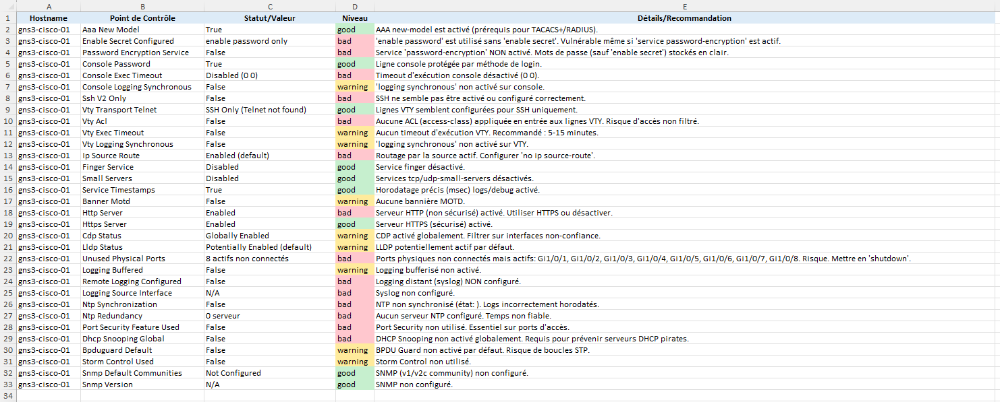

# NetworkMagpie : audit réseau multi-constructeur

[]()
[]()
[](https://www.gnu.org/licenses/gpl-3.0)

NetworkMagpie est une collection de scripts Python conçus pour réaliser des audits de configuration et de sécurité sur des équipements réseau de différents constructeurs. Actuellement, il supporte les équipements Cisco IOS-XE et une prise en charge pour Aruba OS-CX est en cours de développement actif.

L'objectif est de fournir des rapports clairs et exploitables pour aider les administrateurs réseau à maintenir la conformité, la sécurité et la performance de leurs infrastructures.

## Fonctionnalités Actuelles

* Audit pour Cisco IOS-XE (`cisco_audit.py`) :
    - Listage complet des interfaces physiques et virtuelles (avec IPs et états).
    - Inventaire des VLANs configurés (ID, nom, statut, ports).
    - Collecte de la table ARP.
    - Audit de sécurité étendu vérifiant de nombreuses bonnes pratiques et configurations de sécurité (AAA, SSH, mots de passe, services inutiles, logging, NTP, sécurité de couche 2, etc.).
    - Génération de rapports en formats JSON (brut) et Excel (formaté avec couleurs pour la criticité).
* Audit pour Aruba OS-CX (`aruba_audit.py`) :
    - Collecte des informations générales de l'équipement (modèle, version, S/N, uptime).
    - Listage des interfaces physiques, virtuelles et de management (avec IPs et états).
    - Inventaire des VLANs.
    - Collecte de la table ARP.
    - Audit de sécurité avec des vérifications pour SSH, mots de passe, NTP, SNMP, services HTTP/HTTPS, bannières, logging, etc.
    - Génération de rapports en formats JSON et Excel.
* Dispatcher (`main_audit.py`) :
    - Lit un fichier d'inventaire centralisé.
    - Identifie le type d'équipement (Cisco IOS-XE ou Aruba OS-CX).
    - Lance séquentiellement l'audit approprié pour chaque équipement.
* Gestion des identifiants :
    - Utilise un fichier de mots de passe pour stocker les identifiants.
    - Permet d'affecter des couples login/password à des groupes d'équipements.
* Sorties Multiples :
    - Rapport JSON détaillé pour chaque type d'équipement.
    - Rapport Excel multi-feuilles avec mise en forme conditionnelle (couleurs vert/orange/rouge) pour une lisibilité accrue.


## Aperçu des Rapports Excel

Voici un aperçu des différentes feuilles générées dans le rapport Excel :

1.  **Feuille "Infos Générales" :** Vue sommaire de l'équipement.
    

2.  **Feuille "Interfaces" :** Détail des interfaces physiques et virtuelles.
    

3.  **Feuille "VLANs" :** Liste des VLANs et de leurs ports.
    

4.  **Feuille "Table ARP" :** Contenu de la table ARP de l'équipement.
    

5.  **Feuille "Audit Sécurité" :** Résultats des vérifications de sécurité avec niveaux de criticité.
    


## Prérequis

* Python 3.6+
* Librairies Python :
    - `netmiko`
    - `openpyxl`
    - `textfsm` (généralement installé avec Netmiko ou `ntc-templates`)
    - `ntc-templates` (recommandé pour un meilleur parsing avec Netmiko)

Vous pouvez installer les dépendances avec pip :
```bash
pip install netmiko openpyxl ntc-templates
```

## Structure des Fichiers

* `main_audit.py`: Script principal pour lancer les audits.
* `cisco_audit.py`: Script d'audit pour les équipements Cisco IOS-XE.
* `aruba_audit.py`: Script d'audit pour les équipements Aruba OS-CX.
* `inventory.csv`: Fichier d'inventaire des équipements.
* `passwords.csv`: Fichier des identifiants groupés.
* `audit_reports/`: Répertoire où les rapports JSON et Excel sont sauvegardés.

## Configuration

### 1. Fichier d'inventaire (`inventory.csv`)

Ce fichier CSV contient la liste des équipements à auditer.
Format : `hostname_or_ip,group_name,device_type`

Colonnes :
* `hostname_or_ip` : Adresse IP ou nom DNS de l'équipement.
* `group_name` : Nom du groupe auquel l'équipement appartient (pour la gestion des mots de passe).
* `device_type` : Type d'OS de l'équipement. Valeurs supportées actuellement :
    - `cisco_ios` (pour Cisco IOS et IOS-XE)
    - `aruba_os-cx`

Exemple :
```csv
hostname_or_ip,group_name,device_type
192.168.1.10,core-switches,cisco_ios
10.0.0.5,access-aruba,aruba_os-cx
switch-cisco-dist,core-switches,cisco_ios
aruba-cx-spine,spine-aruba,aruba_os-cx
```

### 2. Fichier des mots de passe (`passwords.csv`)

Ce fichier CSV associe les identifiants de connexion aux groupes définis dans `inventory.csv`.
Format : `group_name,username,password,enable_password`

Colonnes :
* `group_name` : Nom du groupe (doit correspondre à celui dans `inventory.csv`).
* `username` : Nom d'utilisateur pour la connexion.
* `password` : Mot de passe de l'utilisateur.
* `enable_password` : (Optionnel) Mot de passe `enable` (secret). Laissez vide si non applicable.

Exemple :
```csv
group_name,username,password,enable_password
core-switches,audituser,SecurePass123,EnableSecretHere
access-aruba,arubaadmin,ArubaPass!,arubaenable
spine-aruba,arubaadmin,ArubaPass!,arubaenable
```
**Sécurité :** Assurez-vous que ce fichier est stocké de manière sécurisée et que ses permissions sont restreintes.

## Utilisation

Pour lancer un audit complet sur tous les équipements listés dans l'inventaire :
```bash
python main_audit.py
```

Les scripts d'audit pour chaque constructeur peuvent également être lancés indépendamment. Ils liront alors l'inventaire et ne traiteront que les équipements correspondant à leur type.
```bash
python cisco_audit.py
python aruba_audit.py
```

Les rapports seront générés dans le répertoire `audit_reports/`.

## Fonctionnement Détaillé

Chaque script d'audit (`cisco_audit.py`, `aruba_audit.py`) se connecte aux équipements via SSH (en utilisant Netmiko) et exécute une série de commandes `show` pour collecter des informations.

Les informations collectées incluent :
* **Informations Générales :** Modèle, version de l'OS, numéro de série, uptime, hostname.
* **Interfaces :** Liste de toutes les interfaces (physiques, virtuelles, management), leur état (lien, protocole), adresses IP, descriptions, VLANs associés, duplex, vitesse.
* **VLANs :** Liste des VLANs avec ID, nom, statut, et ports membres.
* **Table ARP :** Adresses IP, adresses MAC, interfaces associées.
* **Audit de Sécurité :** Une série de vérifications basées sur les bonnes pratiques de sécurité pour l'OS spécifique (configuration AAA, politique de mots de passe, services actifs, sécurité des accès, logging, NTP, SNMP, protections de couche 2, etc.).

Les données brutes sont sauvegardées au format JSON. Un rapport Excel plus lisible est également généré, utilisant des couleurs pour indiquer les niveaux de criticité des points d'audit de sécurité :
* **Vert :** Conforme / Bonne pratique appliquée.
* **Orange :** Avertissement / Point à vérifier ou à améliorer.
* **Rouge :** Non conforme / Risque de sécurité ou problème de configuration.

## Contribuer

Les contributions sont les bienvenues ! Si vous souhaitez étendre le support à d'autres constructeurs, ajouter de nouvelles vérifications d'audit, ou améliorer le parsing des commandes :

1.  Forkez le projet.
2.  Créez une nouvelle branche (`git checkout -b feature/nouvelle-fonctionnalite`).
3.  Faites vos modifications.
4.  Envoyez une Pull Request.

## Axes d'Amélioration Futurs

* Support d'autres constructeurs (Extreme, Fortinet, etc.).
* Audit plus approfondi de fonctionnalités spécifiques (ex: configuration détaillée du port-security, listes de contrôle d'accès).
* Utilisation de templates TextFSM/Genie plus exhaustifs pour Aruba OS-CX (nécessite des templates communautaires à jour ou la création de templates personnalisés).
* Interface web simple pour lancer les audits et visualiser les rapports.
* Gestion plus sécurisée des mots de passe (ex: intégration avec un coffre-fort de secrets comme HashiCorp Vault, Ansible Vault).
* Parallélisation des audits pour améliorer la vitesse sur de grands inventaires (utilisation de `threading` ou `asyncio`).
* Option pour générer un rapport consolidé unique (HTML ou PDF).
* Tests unitaires et d'intégration pour assurer la fiabilité des scripts lors des évolutions.

## Licence

## Licence

Ce projet est distribué sous les termes de la Licence Publique Générale GNU version 3 (GNU GPLv3).
Une copie de la licence devrait être incluse avec ce projet dans le fichier `LICENSE`.
Sinon, vous pouvez la trouver sur [https://www.gnu.org/licenses/gpl-3.0.html](https://www.gnu.org/licenses/gpl-3.0.html).
